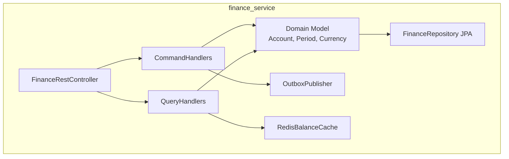

# C4 Nivel 3 — Componentes (ejemplo: finance-service)

```mermaid
flowchart TB
  subgraph finance_service
    API[FinanceRestController]
    CH[CommandHandlers]
    QH[QueryHandlers]
    DOM[Domain Model\nAccount, Period, Currency]
    REPO[FinanceRepository JPA]
    OUT[OutboxPublisher]
    CACHE[RedisBalanceCache]
  end

  API --> CH
  API --> QH
  CH --> DOM
  QH --> DOM
  DOM --> REPO
  CH --> OUT
  QH --> CACHE
```
