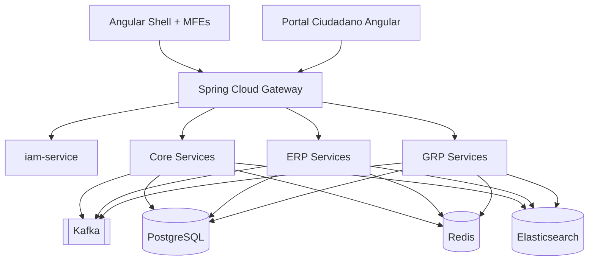

# C4 Nivel 2 — Contenedores

```mermaid
flowchart TB
  WEB[Angular Shell + MFEs]
  PORTAL[Portal Ciudadano Angular]
  GW[Spring Cloud Gateway]
  IAM[iam-service]
  CORE[Core Services]
  ERP[ERP Services]
  GRP[GRP Services]
  KAFKA[[Kafka]]
  PG[(PostgreSQL)]
  REDIS[(Redis)]
  ES[(Elasticsearch)]

  WEB --> GW
  PORTAL --> GW
  GW --> IAM
  GW --> CORE
  GW --> ERP
  GW --> GRP
  CORE & ERP & GRP --> KAFKA
  CORE & ERP & GRP --> PG
  CORE & ERP & GRP --> REDIS
  CORE & ERP & GRP --> ES
```
