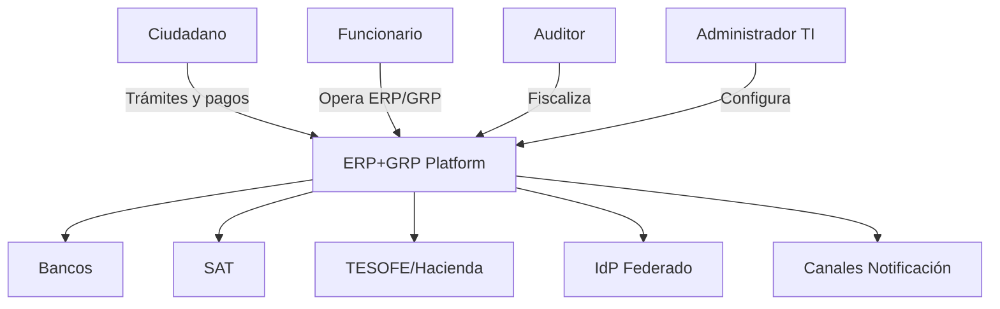

# C4 Nivel 1 — Contexto

```mermaid
flowchart TB
  CIT[Ciudadano]
  EMP[Funcionario]
  AUD[Auditor]
  ADM[Administrador TI]
  SYS[ERP+GRP Platform]
  BANK[Bancos]
  SAT[SAT]
  TES[TESOFE/Hacienda]
  IDP[IdP Federado]
  NCH[Canales Notificación]

  CIT -->|Trámites y pagos| SYS
  EMP -->|Opera ERP/GRP| SYS
  AUD -->|Fiscaliza| SYS
  ADM -->|Configura| SYS
  SYS --> BANK
  SYS --> SAT
  SYS --> TES
  SYS --> IDP
  SYS --> NCH
```
