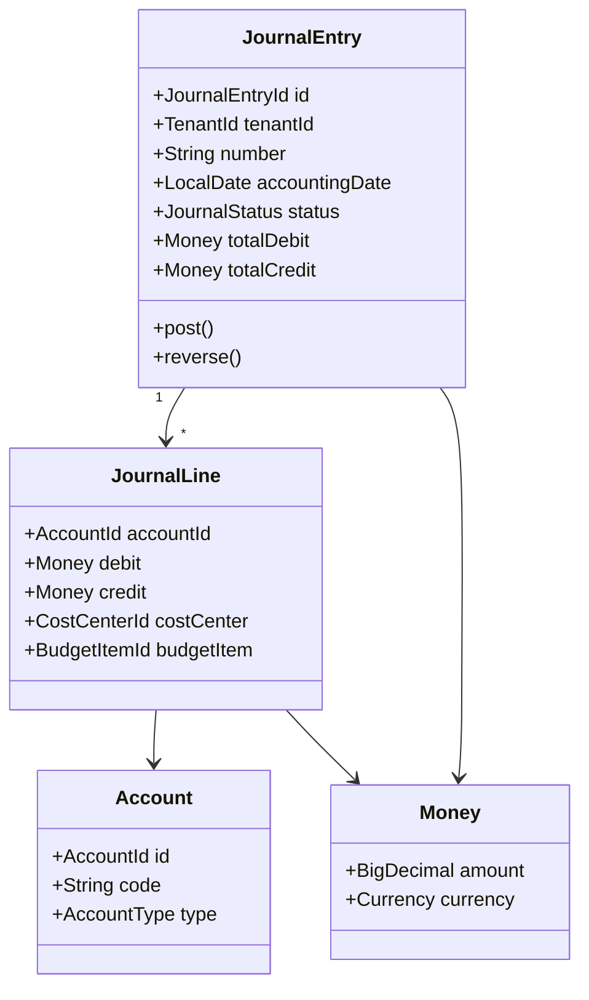

# Diagrama de clases — Accounting JournalEntry

```mermaid
classDiagram
  class JournalEntry {
    +JournalEntryId id
    +TenantId tenantId
    +String number
    +LocalDate accountingDate
    +JournalStatus status
    +Money totalDebit
    +Money totalCredit
    +post()
    +reverse()
  }
  class JournalLine {
    +AccountId accountId
    +Money debit
    +Money credit
    +CostCenterId costCenter
    +BudgetItemId budgetItem
  }
  class Account {
    +AccountId id
    +String code
    +AccountType type
  }
  class Money {
    +BigDecimal amount
    +Currency currency
  }
  JournalEntry "1" --> "*" JournalLine
  JournalLine --> Account
  JournalLine --> Money
  JournalEntry --> Money
```
