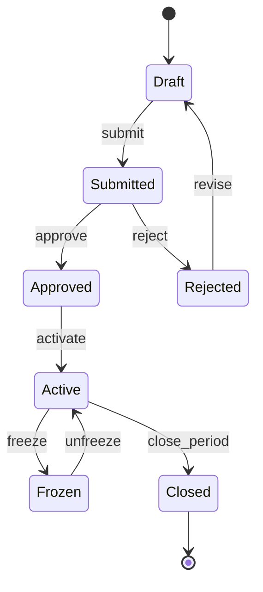

# Diagrama de estados — BudgetAllocation

```mermaid
stateDiagram-v2
  [*] --> Draft
  Draft --> Submitted: submit
  Submitted --> Approved: approve
  Submitted --> Rejected: reject
  Rejected --> Draft: revise
  Approved --> Active: activate
  Active --> Frozen: freeze
  Frozen --> Active: unfreeze
  Active --> Closed: close_period
  Closed --> [*]
```
