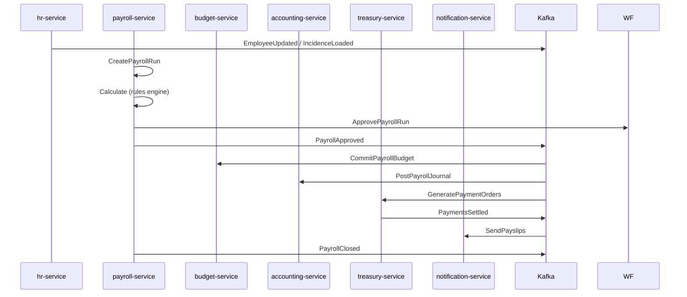

# UML Secuencia — Ciclo de Nómina

```mermaid
sequenceDiagram
  participant HR as hr-service
  participant PAY as payroll-service
  participant BUD as budget-service
  participant ACC as accounting-service
  participant TRE as treasury-service
  participant NTF as notification-service
  participant K as Kafka

  HR->>K: EmployeeUpdated / IncidenceLoaded
  PAY->>PAY: CreatePayrollRun
  PAY->>PAY: Calculate (rules engine)
  PAY->>WF: ApprovePayrollRun
  PAY->>K: PayrollApproved
  K->>BUD: CommitPayrollBudget
  K->>ACC: PostPayrollJournal
  K->>TRE: GeneratePaymentOrders
  TRE->>K: PaymentsSettled
  K->>NTF: SendPayslips
  PAY->>K: PayrollClosed
```
