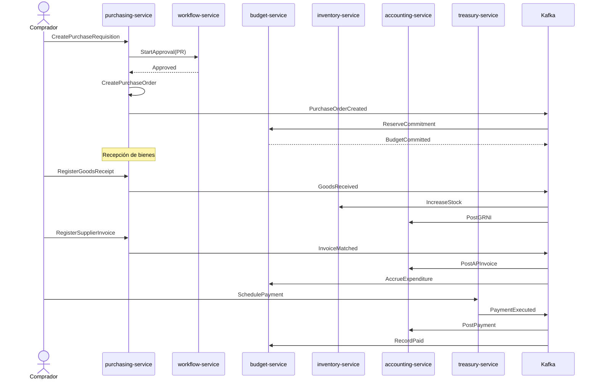

# UML Secuencia — Procure to Pay

```mermaid
sequenceDiagram
  actor User as Comprador
  participant PUR as purchasing-service
  participant WF as workflow-service
  participant BUD as budget-service
  participant INV as inventory-service
  participant ACC as accounting-service
  participant TRE as treasury-service
  participant K as Kafka

  User->>PUR: CreatePurchaseRequisition
  PUR->>WF: StartApproval(PR)
  WF-->>PUR: Approved
  PUR->>PUR: CreatePurchaseOrder
  PUR->>K: PurchaseOrderCreated
  K->>BUD: ReserveCommitment
  BUD-->>K: BudgetCommitted
  Note over PUR: Recepción de bienes
  User->>PUR: RegisterGoodsReceipt
  PUR->>K: GoodsReceived
  K->>INV: IncreaseStock
  K->>ACC: PostGRNI
  User->>PUR: RegisterSupplierInvoice
  PUR->>K: InvoiceMatched
  K->>ACC: PostAPInvoice
  K->>BUD: AccrueExpenditure
  User->>TRE: SchedulePayment
  TRE->>K: PaymentExecuted
  K->>ACC: PostPayment
  K->>BUD: RecordPaid
```
