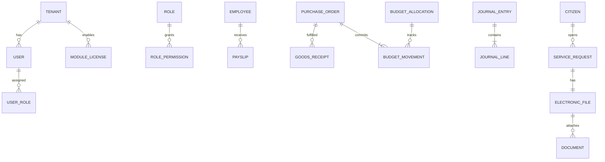

# Modelo Conceptual

```mermaid
erDiagram
  TENANT ||--o{ USER : has
  TENANT ||--o{ MODULE_LICENSE : enables
  USER ||--o{ USER_ROLE : assigned
  ROLE ||--o{ ROLE_PERMISSION : grants
  EMPLOYEE ||--o{ PAYSLIP : receives
  PURCHASE_ORDER ||--o{ GOODS_RECEIPT : fulfilled
  PURCHASE_ORDER ||--|{ BUDGET_MOVEMENT : commits
  JOURNAL_ENTRY ||--|{ JOURNAL_LINE : contains
  BUDGET_ALLOCATION ||--o{ BUDGET_MOVEMENT : tracks
  CITIZEN ||--o{ SERVICE_REQUEST : opens
  SERVICE_REQUEST ||--|| ELECTRONIC_FILE : has
  ELECTRONIC_FILE ||--o{ DOCUMENT : attaches
```

Principio: cada Bounded Context posee su modelo; las líneas entre contextos son **referencias por ID + eventos**, no FK cross-DB.
