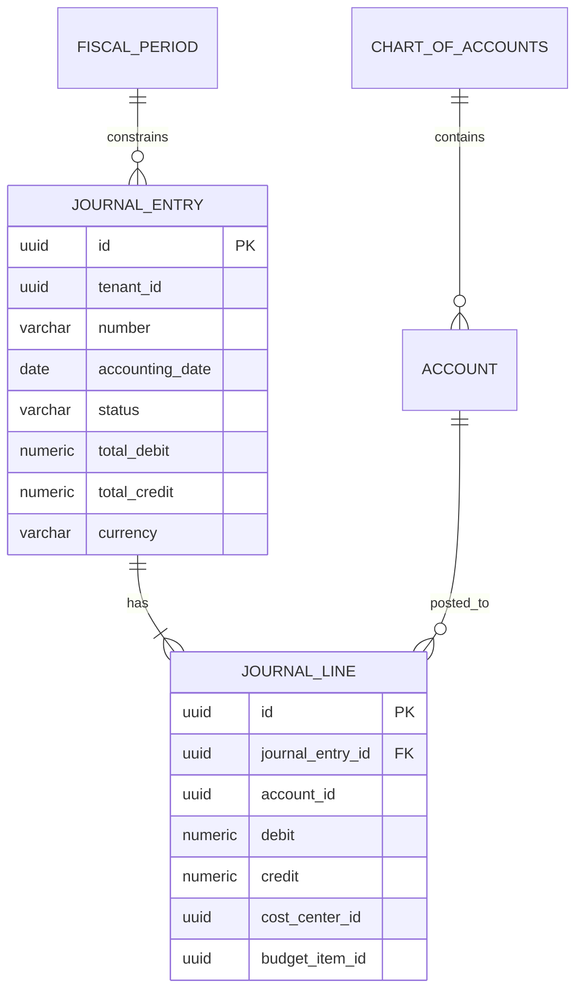

# ERD — Accounting

```mermaid
erDiagram
  CHART_OF_ACCOUNTS ||--o{ ACCOUNT : contains
  JOURNAL_ENTRY ||--|{ JOURNAL_LINE : has
  ACCOUNT ||--o{ JOURNAL_LINE : posted_to
  FISCAL_PERIOD ||--o{ JOURNAL_ENTRY : constrains
  JOURNAL_ENTRY {
    uuid id PK
    uuid tenant_id
    varchar number
    date accounting_date
    varchar status
    numeric total_debit
    numeric total_credit
    varchar currency
  }
  JOURNAL_LINE {
    uuid id PK
    uuid journal_entry_id FK
    uuid account_id
    numeric debit
    numeric credit
    uuid cost_center_id
    uuid budget_item_id
  }
```
