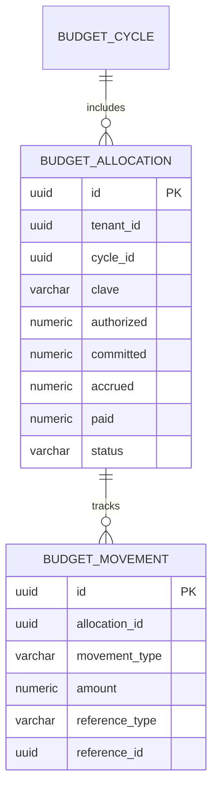

# ERD — Budget

```mermaid
erDiagram
  BUDGET_CYCLE ||--o{ BUDGET_ALLOCATION : includes
  BUDGET_ALLOCATION ||--o{ BUDGET_MOVEMENT : tracks
  BUDGET_ALLOCATION {
    uuid id PK
    uuid tenant_id
    uuid cycle_id
    varchar clave
    numeric authorized
    numeric committed
    numeric accrued
    numeric paid
    varchar status
  }
  BUDGET_MOVEMENT {
    uuid id PK
    uuid allocation_id
    varchar movement_type
    numeric amount
    varchar reference_type
    uuid reference_id
  }
```
