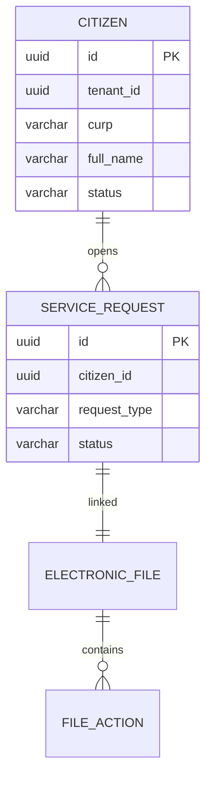

# ERD — Citizen

```mermaid
erDiagram
  CITIZEN ||--o{ SERVICE_REQUEST : opens
  SERVICE_REQUEST ||--|| ELECTRONIC_FILE : linked
  ELECTRONIC_FILE ||--o{ FILE_ACTION : contains
  CITIZEN {
    uuid id PK
    uuid tenant_id
    varchar curp
    varchar full_name
    varchar status
  }
  SERVICE_REQUEST {
    uuid id PK
    uuid citizen_id
    varchar request_type
    varchar status
  }
```
