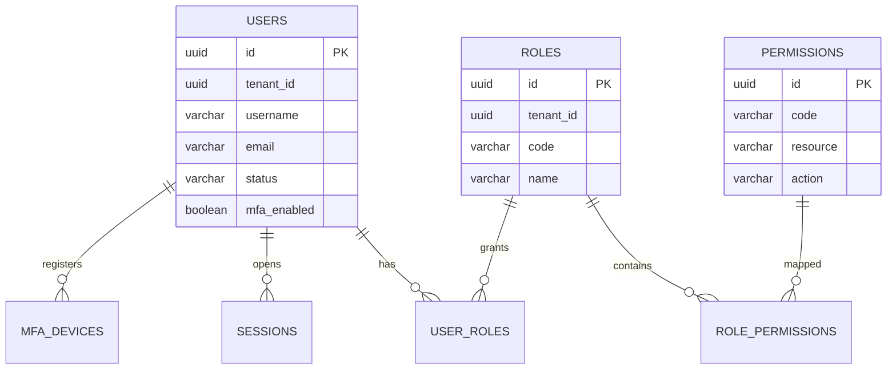

# ERD — IAM

```mermaid
erDiagram
  USERS ||--o{ USER_ROLES : has
  ROLES ||--o{ USER_ROLES : grants
  ROLES ||--o{ ROLE_PERMISSIONS : contains
  PERMISSIONS ||--o{ ROLE_PERMISSIONS : mapped
  USERS ||--o{ SESSIONS : opens
  USERS ||--o{ MFA_DEVICES : registers
  USERS {
    uuid id PK
    uuid tenant_id
    varchar username
    varchar email
    varchar status
    boolean mfa_enabled
  }
  ROLES {
    uuid id PK
    uuid tenant_id
    varchar code
    varchar name
  }
  PERMISSIONS {
    uuid id PK
    varchar code
    varchar resource
    varchar action
  }
```
