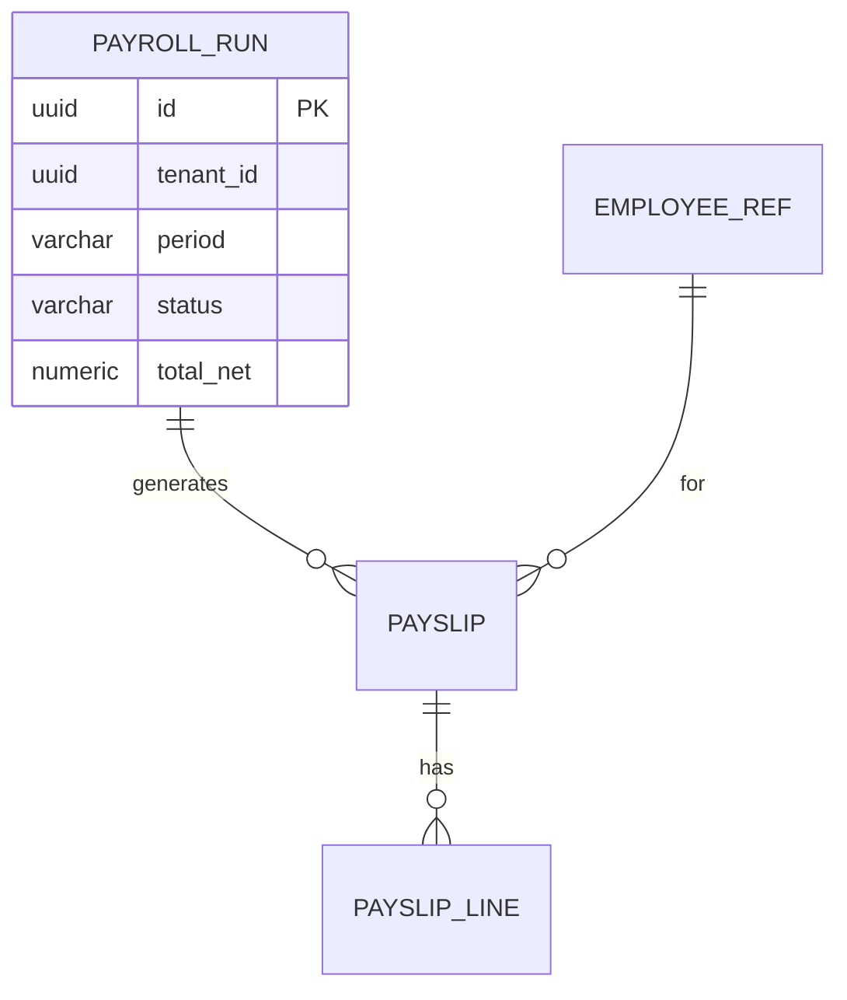

# ERD — Payroll

```mermaid
erDiagram
  PAYROLL_RUN ||--o{ PAYSLIP : generates
  PAYSLIP ||--o{ PAYSLIP_LINE : has
  EMPLOYEE_REF ||--o{ PAYSLIP : for
  PAYROLL_RUN {
    uuid id PK
    uuid tenant_id
    varchar period
    varchar status
    numeric total_net
  }
```
