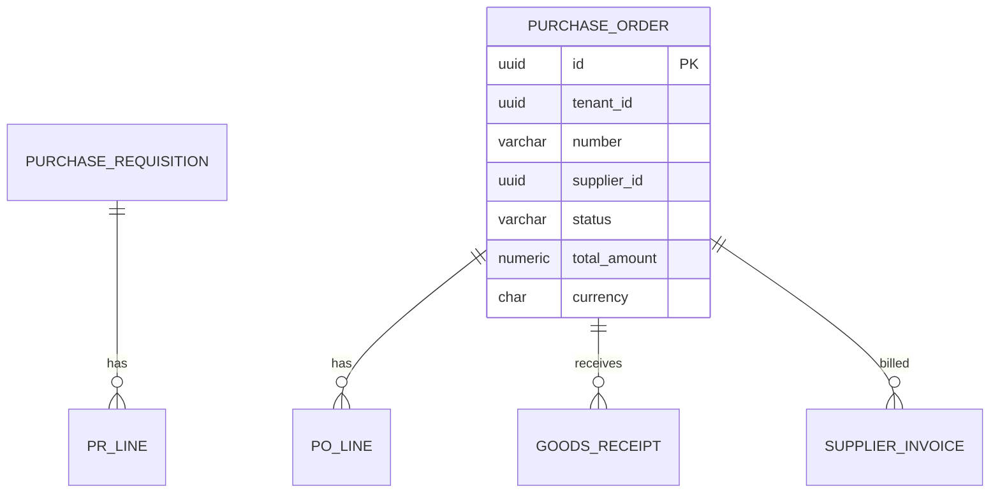

# ERD — Purchasing

```mermaid
erDiagram
  PURCHASE_REQUISITION ||--o{ PR_LINE : has
  PURCHASE_ORDER ||--o{ PO_LINE : has
  PURCHASE_ORDER ||--o{ GOODS_RECEIPT : receives
  PURCHASE_ORDER ||--o{ SUPPLIER_INVOICE : billed
  PURCHASE_ORDER {
    uuid id PK
    uuid tenant_id
    varchar number
    uuid supplier_id
    varchar status
    numeric total_amount
    char currency
  }
```
