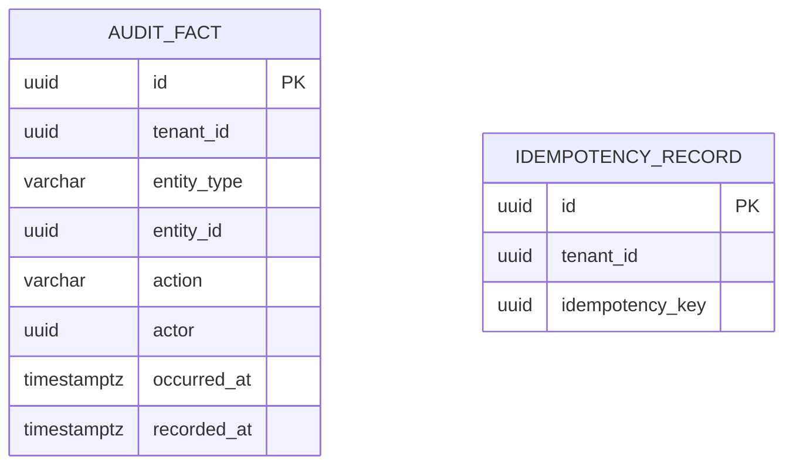

# ERD — audit_db

```mermaid
erDiagram
  AUDIT_FACT {
    uuid id PK
    uuid tenant_id
    varchar entity_type
    uuid entity_id
    varchar action
    uuid actor
    timestamptz occurred_at
    timestamptz recorded_at
  }
  IDEMPOTENCY_RECORD {
    uuid id PK
    uuid tenant_id
    uuid idempotency_key
  }
```
