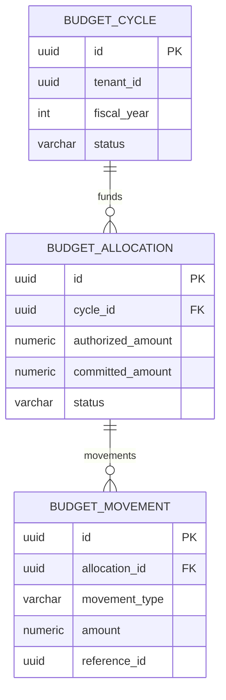

# ERD — budget_db

```mermaid
erDiagram
  BUDGET_CYCLE ||--o{ BUDGET_ALLOCATION : funds
  BUDGET_ALLOCATION ||--o{ BUDGET_MOVEMENT : movements
  BUDGET_CYCLE {
    uuid id PK
    uuid tenant_id
    int fiscal_year
    varchar status
  }
  BUDGET_ALLOCATION {
    uuid id PK
    uuid cycle_id FK
    numeric authorized_amount
    numeric committed_amount
    varchar status
  }
  BUDGET_MOVEMENT {
    uuid id PK
    uuid allocation_id FK
    varchar movement_type
    numeric amount
    uuid reference_id
  }
```
