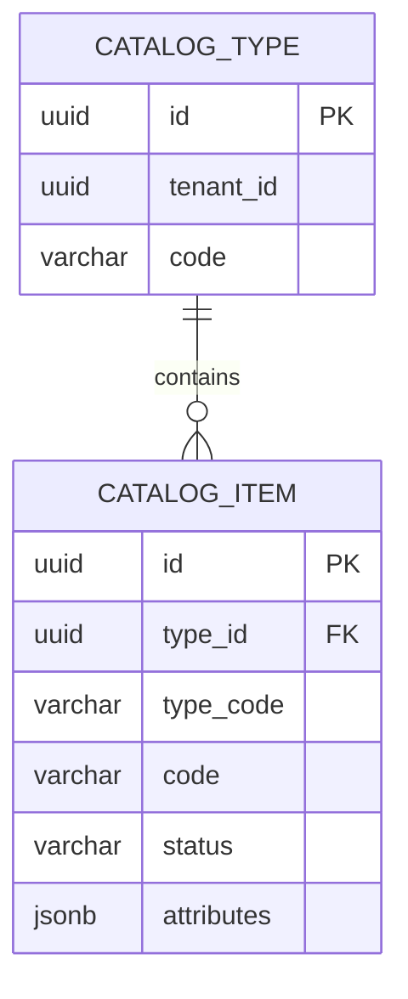

# ERD — catalog_db

```mermaid
erDiagram
  CATALOG_TYPE ||--o{ CATALOG_ITEM : contains
  CATALOG_TYPE {
    uuid id PK
    uuid tenant_id
    varchar code
  }
  CATALOG_ITEM {
    uuid id PK
    uuid type_id FK
    varchar type_code
    varchar code
    varchar status
    jsonb attributes
  }
```
