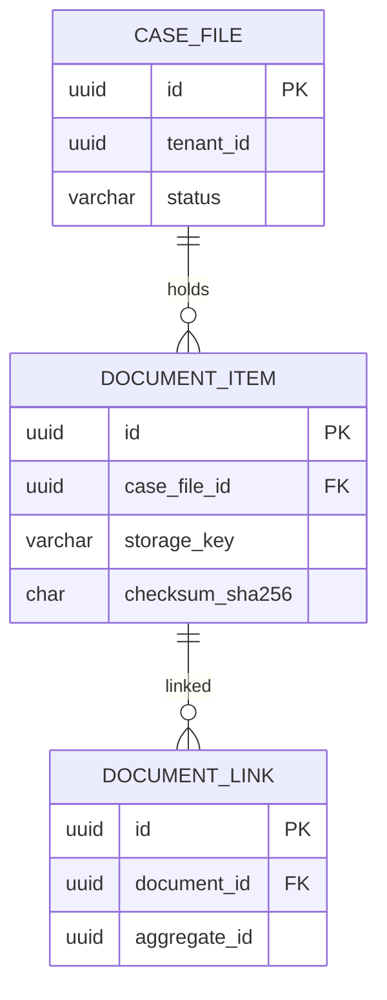

# ERD — document_db

```mermaid
erDiagram
  CASE_FILE ||--o{ DOCUMENT_ITEM : holds
  DOCUMENT_ITEM ||--o{ DOCUMENT_LINK : linked
  CASE_FILE {
    uuid id PK
    uuid tenant_id
    varchar status
  }
  DOCUMENT_ITEM {
    uuid id PK
    uuid case_file_id FK
    varchar storage_key
    char checksum_sha256
  }
  DOCUMENT_LINK {
    uuid id PK
    uuid document_id FK
    uuid aggregate_id
  }
```
