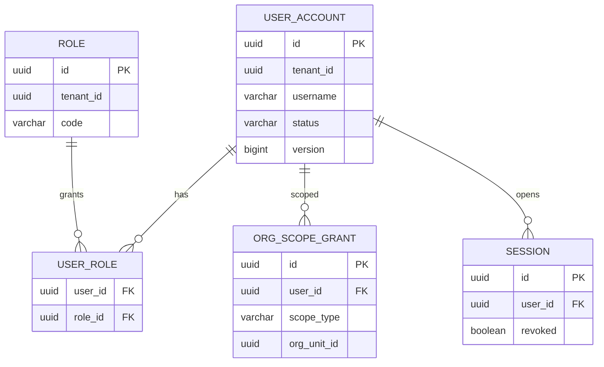

# ERD — iam_db

```mermaid
erDiagram
  USER_ACCOUNT ||--o{ USER_ROLE : has
  ROLE ||--o{ USER_ROLE : grants
  USER_ACCOUNT ||--o{ ORG_SCOPE_GRANT : scoped
  USER_ACCOUNT ||--o{ SESSION : opens
  USER_ACCOUNT {
    uuid id PK
    uuid tenant_id
    varchar username
    varchar status
    bigint version
  }
  ROLE {
    uuid id PK
    uuid tenant_id
    varchar code
  }
  USER_ROLE {
    uuid user_id FK
    uuid role_id FK
  }
  ORG_SCOPE_GRANT {
    uuid id PK
    uuid user_id FK
    varchar scope_type
    uuid org_unit_id
  }
  SESSION {
    uuid id PK
    uuid user_id FK
    boolean revoked
  }
```
