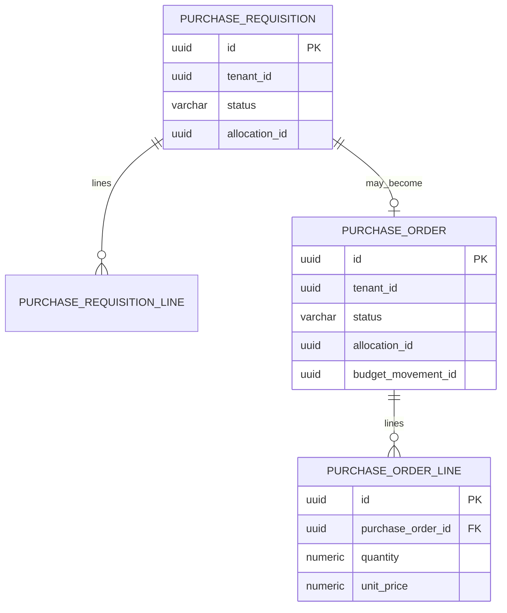

# ERD — procurement_db

```mermaid
erDiagram
  PURCHASE_REQUISITION ||--o{ PURCHASE_REQUISITION_LINE : lines
  PURCHASE_REQUISITION ||--o| PURCHASE_ORDER : may_become
  PURCHASE_ORDER ||--o{ PURCHASE_ORDER_LINE : lines
  PURCHASE_REQUISITION {
    uuid id PK
    uuid tenant_id
    varchar status
    uuid allocation_id
  }
  PURCHASE_ORDER {
    uuid id PK
    uuid tenant_id
    varchar status
    uuid allocation_id
    uuid budget_movement_id
  }
  PURCHASE_ORDER_LINE {
    uuid id PK
    uuid purchase_order_id FK
    numeric quantity
    numeric unit_price
  }
```
