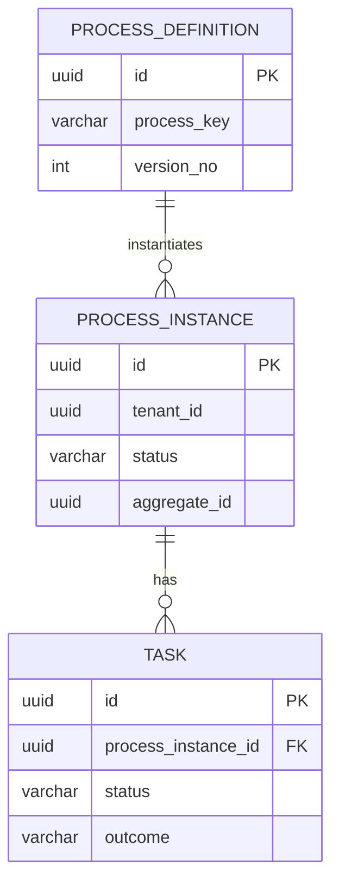

# ERD — workflow_db

```mermaid
erDiagram
  PROCESS_DEFINITION ||--o{ PROCESS_INSTANCE : instantiates
  PROCESS_INSTANCE ||--o{ TASK : has
  PROCESS_DEFINITION {
    uuid id PK
    varchar process_key
    int version_no
  }
  PROCESS_INSTANCE {
    uuid id PK
    uuid tenant_id
    varchar status
    uuid aggregate_id
  }
  TASK {
    uuid id PK
    uuid process_instance_id FK
    varchar status
    varchar outcome
  }
```
