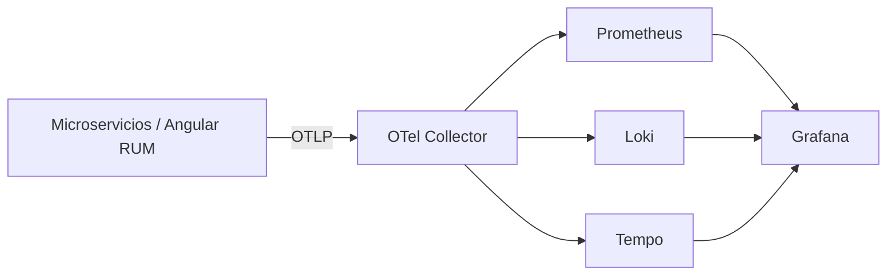

# Stack

```mermaid
flowchart LR
  APP[Microservicios / Angular RUM] -->|OTLP| COL[OTel Collector]
  COL --> PROM[Prometheus]
  COL --> LOKI[Loki]
  COL --> TEMPO[Tempo]
  PROM --> GRAF[Grafana]
  LOKI --> GRAF
  TEMPO --> GRAF
```

- Traces: OpenTelemetry Java agent + W3C Trace Context
- Metrics: Micrometer → OTLP/Prometheus
- Logs: JSON stdout → Fluent Bit / OTel → Loki
- Correlation: `traceId` en logs
